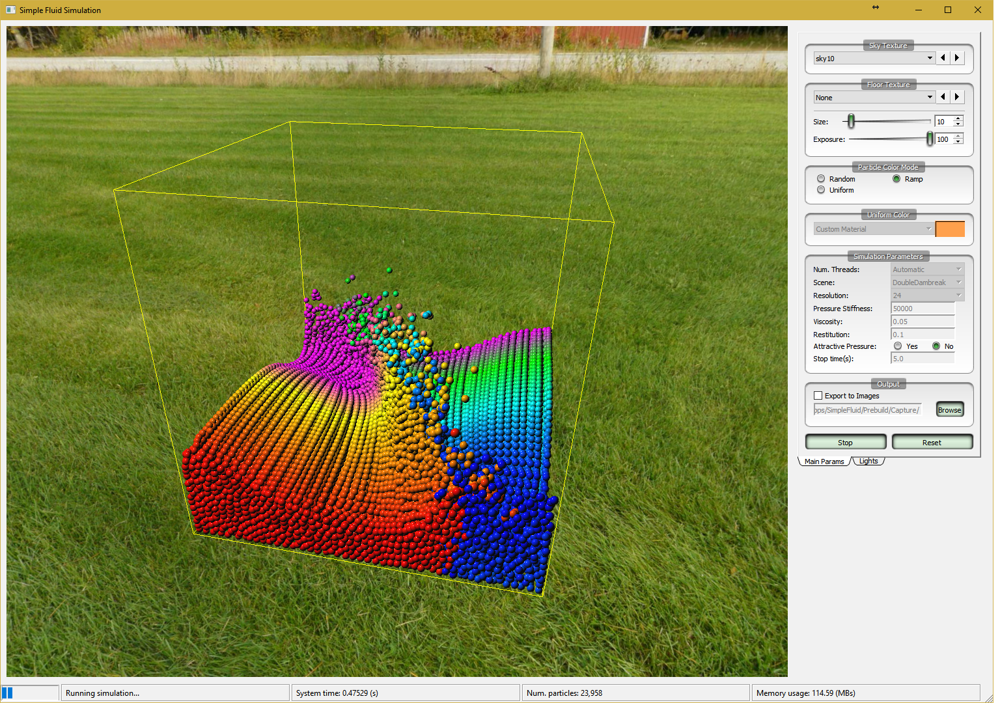

# Simple Fluid Simulation using Smoothed Particle Hydrodynamics (SPH)

* The program is implemented in Qt 5.9 framework.
* Multi-threading by Intel TBB libary.
* Skybox textures in folder Textures/Sky are automatically loaded at start up.
* Press Spacebar key to pause/resume the simulation.
* Press 'R' key to reset camera view.
* A Prebuild has been provided to run immediately.
* As my implementation depends on a lots of external libaries, the source code can only be compiled by me.

---

# Screenshots:

---
 
# Video:
---
<iframe src="https://player.vimeo.com/video/228570357" width="960" height="540" frameborder="0" webkitallowfullscreen mozallowfullscreen allowfullscreen></iframe>
